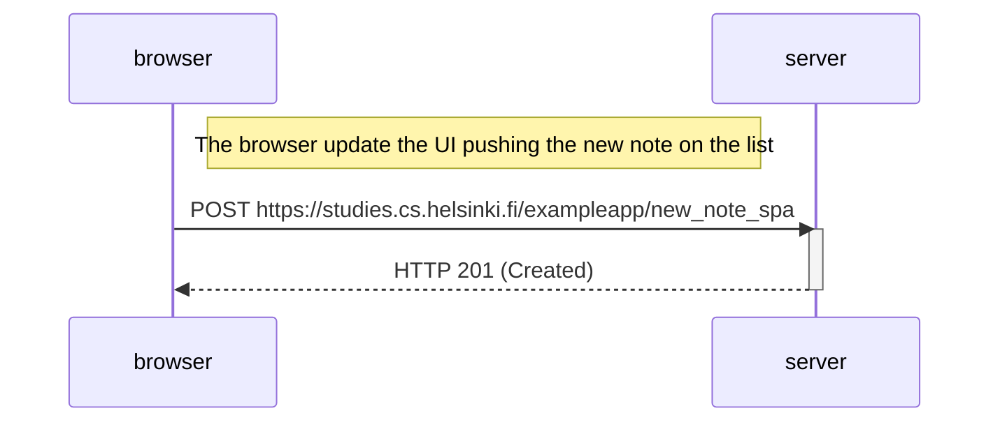

## Sequence Diagram: creating new note (SPA)

Sequence diagram to send new note to the server:

https://studies.cs.helsinki.fi/exampleapp/spa

```mermaid
sequenceDiagram
participant browser
participant server

    Note right of browser: The browser update the UI pushing the new note on the list

    browser->>server: POST https://studies.cs.helsinki.fi/exampleapp/new_note_spa

    activate server
    server-->>browser: HTTP 201 (Created)
    deactivate server
```
